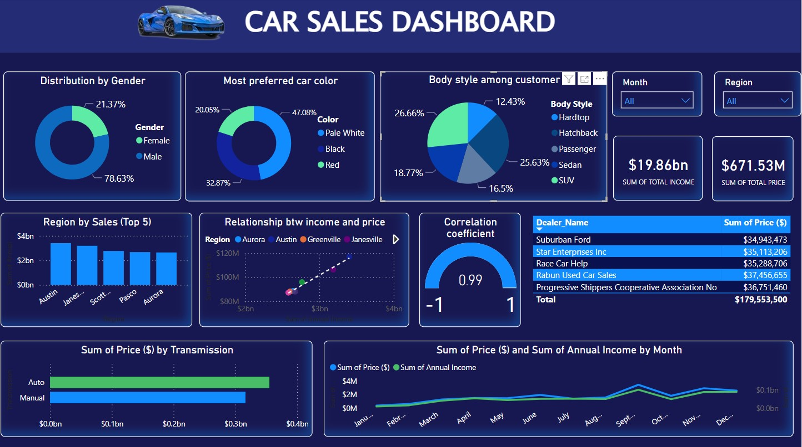
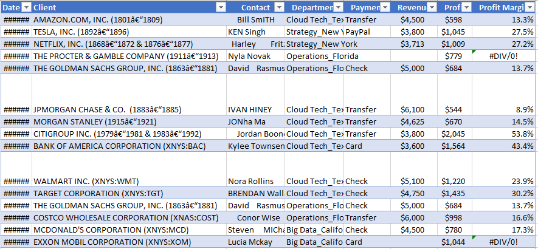
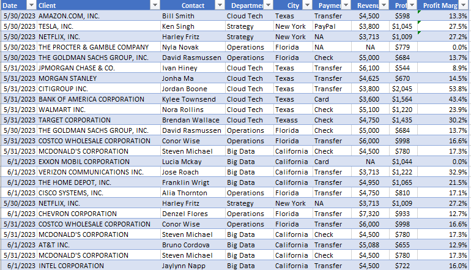
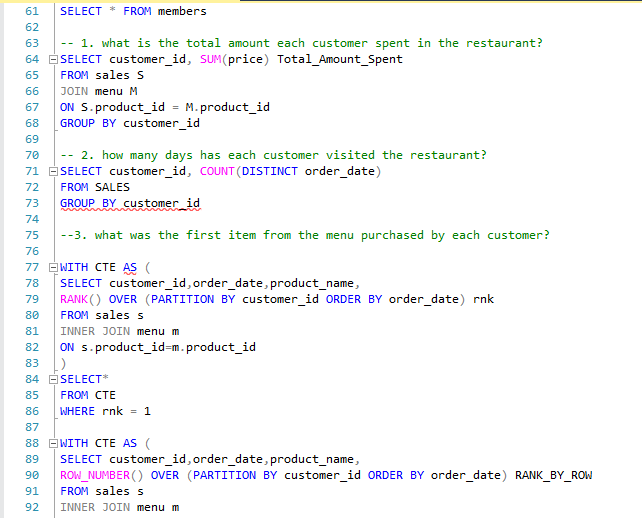

# Data Analyst

#### Technical Skills: Python, SQL, MS Excel, PowerBI

## Education 			        		
- B.Tech., Applied Geophysics | The Federal University of Teechnology, Akure (_March 2024_)

## Work Experience
**Data Analysis Facilitator @ Kinplus Technologies (_2024 - Present_)**
- Led workshops and training sessions on data analysis techniques and tools
- Developed and delivered instructional materials, including presentations and hands-on exercises, to enhance participants' understanding of data analysis concepts
- Provided one-on-one support to team members, addressing specific analytical challenges and offering solutions

**Data Analyst Intern @ Sabi Programmers (_2024 - Present_)**
- Assisted in collecting, cleaning, and organizing data from various sources to ensure accuracy and completeness
- Utilized analytical tools (e.g., Excel, SQL, Python) to perform data analysis and generate insights for ongoing projects
- Created visualizations and reports to communicate findings to team members and stakeholders
  
## Projects
### DATA-CAR SALES:TRENDS AND ANALYSIS ([Files](https://drive.google.com/drive/folders/1_evVvioLyGotZ7QaLHPc9o14-P6fU1_N))

The goal of this research is to thoroughly analyze car sales dataset to reveal valuable insights. These insights will inform strategic decision making in car productions and determine the impact of various factors on sales performance 
#### Objectives
- Identify sales trends and patterns
- Perform geographic analysis of sales data to identify high performing regions
- Perform relationship between annual income and price by region
#### My Role
As the lead data analyst, I was responsible for data collection, cleaning, and exploratory analysis. I employed statistical methods to build a predictive model. I also created visualizations and reports to present findings to the directors.

### NYSC DATA EVALUATION ([File](https://drive.google.com/drive/folders/1itLjB3nIVSMvKq6ZorcbVlNxxj_w1iWS))
The aim is to analyze and present the opinions and feedback gathered from National Youth Service Corps (NYSC) members during the 2024 Batch Stream 1 orientation course survey. 
#### Key Tasks
- Data Collection: Gathered customer reviews from various sources.
- Preprocessing: Cleaned and preprocessed text data by removing stopwords, punctuation, and normalizing text.
- Visualization: Created visualizations to represent sentiment trends and key insights.
#### Tools Used
- MS Excel
- PowerBI
#### Outcome
Generated actionable insights into Corpers' member sentiment, helping identify strengths and areas for improvement based on review analysis.

## DATA CLEANING-PAYMENT ([Files](https://drive.google.com/drive/folders/1eLb3tvhhf2dR6_tkY0VrJ-gm65OjnjlA))
The aim was to improve the quality of a retail sales dataset to ensure accurate and reliable analysis.
#### Key Tasks
- Removed Duplicates: Eliminated redundant records to enhance dataset accuracy.
- Standardized Formats: Consistent date formats and harmonized categorical data.
- Corrected Errors: Addressed data entry errors and outliers using automated scripts.
#### Tools Used
-  MS Excel (Power Query)
  
#### Outcome
Delivered a clean, reliable dataset, ready for advanced analysis and reporting, resulting in improved data integrity and analytical efficiency.

## DANNY DINNER WEEK([Files](https://drive.google.com/drive/folders/1qF3_MtzcEQXNX8O0SACtdIBJodff20B))
Analyze data to identify trends and performance metrics.
#### Key Tasks
- Data Extraction: Wrote complex SQL queries to extract and aggregate data from multiple tables.
- Performance Metrics: Calculated key performance indicators (KPIs)

#### Tools Used
- SQL
  

