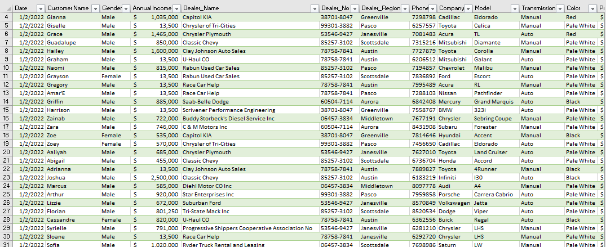

# Data Analyst

#### Technical Skills: Python, SQL, MS Excel, PowerBI

## Education 			        		
- B.Tech., Applied Geophysics | The Federal University of Teechnology, Akure (_March 2024_)

## Work Experience
**Data Analysis Facilitator @ Kinplus Technologies (_2024 - Present_)**
- Led workshops and training sessions on data analysis techniques and tools
- Developed and delivered instructional materials, including presentations and hands-on exercises, to enhance participants' understanding of data analysis concepts
- Provided one-on-one support to team members, addressing specific analytical challenges and offering solutions

**Data Analyst Intern @ Sabi Programmers (_2024 - Present_)**
- Assisted in collecting, cleaning, and organizing data from various sources to ensure accuracy and completeness
- Utilized analytical tools (e.g., Excel, SQL, Python) to perform data analysis and generate insights for ongoing projects
- Created visualizations and reports to communicate findings to team members and stakeholders
## Projects
### Data-CAR SALES: TRENDS AND ANALYSIS
The goal of this research is to thoroughly analyze car sales dataset to reveal valuable insights. These insights will inform strategic decision making in car productions and determine the impact of various factors on sales performance 
#### Objectives
- Identify sales trends and patterns
- Perform geographic analysis of sales data to identify high performing regions
- Perform relationship between annual income and price by region
#### My Role
As the lead data analyst, I was responsible for data collection, cleaning, and exploratory analysis. I employed statistical methods to build a predictive model. I also created visualizations and reports to present findings to directors.

### NYSC DATA EVALUATION
[Publication](https://www.mdpi.com/1424-8220/22/11/4240)
The aim IS to analyze and present the opinions and feedback gathered from National Youth Service Corps (NYSC) members during the 2024 Batch Stream 1 orientation course survey. The report aims to provide insights into various aspects of the NYSC program as perceived by the Corps members, thereby contributing to a better understanding of their experiences and perspectives.

## Data Cleaning

