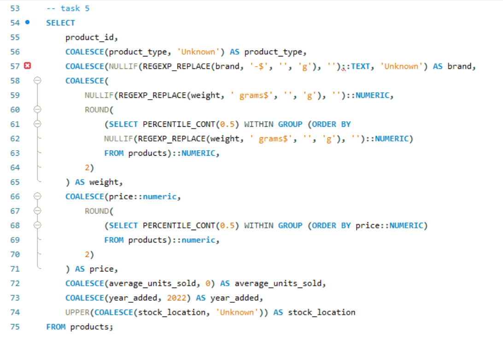

# Data Analyst 
[Linkedln](https://www.linkedin.com/in/benjamin-adeniyi-84336021a/) , [CV](https://drive.google.com/file/d/1iCzuKWNvBr3xXOKHcKW_M77KSf58x99T/view?usp=sharing) 

#### Technical Skills: Python, SQL, MS Excel, PowerBI

## Education 			        		
- B.Tech. Applied Geophysics | The Federal University of Teechnology, Akure (_March 2024_)

## Work Experience
**Data Analysis Facilitator @ Kinplus Technologies (_2024 - Present_)**
- Led workshops and training sessions on data analysis techniques and tools
- Developed and delivered instructional materials, including presentations and hands-on exercises, to enhance participants' understanding of data analysis concepts
- Provided one-on-one support to team members, addressing specific analytical challenges and offering solutions.

  **Graphics Designer @ RICHEM (_2018 - present_)**
- Design Church Materials: Develop brochures, flyers, and posters for events, services, and programs
- Event Branding: Design promotional materials for special events such as fundraisers, community outreach programs, and seasonal services
- Update Materials: Regularly update and refresh visual content to keep it relevant and engaging.

**Data Analyst Intern @ Sabi Programmers (_2024 - 2025_)**
- Assisted in collecting, cleaning, and organizing data from various sources to ensure accuracy and completeness
- Utilized analytical tools (e.g., Excel, SQL, Python) to perform data analysis and generate insights for ongoing projects
- Created visualizations and reports to communicate findings to team members and stakeholders.

**Social Media Manager @ Amplify (_2023 - 2024_)**
- Content Creation, Strategy and Campaign Management
- Platform Management and Engagement & Community Management
- Created visualizations and reports to communicate findings to team members and stakeholders

  
## Projects

### Supplier Quality Analysis ([Files](https://drive.google.com/file/d/1hQmO7iMxGymsAovIdMgpWyVI4OpoAfVA/view?usp=sharing))

The goal of this research is to establish a procurement system that enables the company to effectively track and evaluate supplier performance, ensuring the consistent delivery of high-quality goods. 
#### Objectives
- Analyze which vendors/plants are causing the greatest defect quantity
- Analyze which vendors/plants are causing the greatest downtime
- Is there a particular combination of material and vendor that perform poorly
- Is there a particular combination of Vendor and plant that performs poorly
- How does the same vendor and material perform across different plants
  
#### My Role
Support the development and implementation of the procurement system by designing data collection and analysis processes that track supplier performance. This includes identifying key quality metrics, analyzing procurement and supplier data to uncover trends, and generating actionable insights to inform purchasing decisions and supplier evaluations.

#### Tools Used
- MS Excel
- PowerBI

### PRODUCT ANALYSIS ([Files](https://drive.google.com/file/d/12ywT0VU3BCWdjjQRbaqOiPz_c5uig5Xr/view?usp=sharing))
To enhance data quality and analytical reporting on the products table by cleaning, standardizing, and deriving meaningful insights to support better inventory and sales decision-making.
#### Objective
- Data Cleaning and Standardization
- Data Quality Assessment
- Product Pricing Insights
- Sales Performance Filtering
- Redundant Query Validation
#### My Role
As a Data Analyst, I cleaned, transformed, and analyzed product data using SQL to ensure data quality, uncover pricing and sales insights, and support strategic decision-making.

#### Tools Used
- SQL
  

### Car Sales:Trends And Analysis ([Files](https://drive.google.com/drive/folders/1_evVvioLyGotZ7QaLHPc9o14-P6fU1_N))

The goal of this research is to thoroughly analyze car sales dataset to reveal valuable insights. These insights will inform strategic decision making in car productions and determine the impact of various factors on sales performance 
#### Objectives
- Identify sales trends and patterns
- Perform geographic analysis of sales data to identify high performing regions
- Perform relationship between annual income and price by region
  
#### My Role
As the lead data analyst, I was responsible for data collection, cleaning, and exploratory analysis. I employed statistical methods to build a predictive model. I also created visualizations and reports to present findings to the directors.

#### Tools Used
- MS Excel
- PowerBI

### Fashion Metric  ([Files](https://drive.google.com/drive/folders/1LoihGf4wOzdDVg-qqYQzGvpfQFXs-xIX))

The primary aim of this report is to analyze and visualize sales data to uncover trends, performance metrics, and actionable insights.

#### Objectives
- Identify top-performing retailers and State
- Understand regional and monthly sales trends
- Evaluate the effectiveness of different sales methods
- Assess pricing strategies and their impact on sales
  
#### My Role
As the lead data analyst, I was responsible for data collection, cleaning, and exploratory analysis. I employed statistical methods to build a predictive model. I also created visualizations and reports to present findings to the board.

#### Tools Used
- PowerBI
  
  
### NYSC Data Evaluation ([File](https://drive.google.com/drive/folders/1itLjB3nIVSMvKq6ZorcbVlNxxj_w1iWS))
The aim is to analyze and present the opinions and feedback gathered from National Youth Service Corps (NYSC) members during the 2024 Batch Stream 1 orientation course survey. 
#### Key Tasks
- Data Collection: Gathered customer reviews from various sources.
- Preprocessing: Cleaned and preprocessed text data by removing stopwords, punctuation, and normalizing text.
- Visualization: Created visualizations to represent sentiment trends and key insights
  
#### Tools Used
- MS Excel
- PowerBI
  
#### Outcome
Generated actionable insights into Corpers' member sentiment, helping identify strengths and areas for improvement based on review analysis

### Data Cleaning-Payment ([Files](https://drive.google.com/drive/folders/1eLb3tvhhf2dR6_tkY0VrJ-gm65OjnjlA))
The aim was to improve the quality of a retail sales dataset to ensure accurate and reliable analysis.
#### Key Tasks
- Removed Duplicates: Eliminated redundant records to enhance dataset accuracy.
- Standardized Formats: Consistent date formats and harmonized categorical data.
- Corrected Errors: Addressed data entry errors and outliers using automated scripts.
  
#### Tools Used
-  MS Excel (Power Query)
  
#### Outcome
Delivered a clean, reliable dataset, ready for advanced analysis and reporting, resulting in improved data integrity and analytical efficiency.

### DANNY DINNER WEEK([Files](https://drive.google.com/drive/folders/1qF3_MtzcEQXNX8O0SACtdIBJodff20B))
Analyze data to identify trends and performance metrics.
#### Key Tasks
- Data Extraction: Wrote complex SQL queries to extract and aggregate data from multiple tables.
- Performance Metrics: Calculated key performance indicators (KPIs)

#### Tools Used
- SQL
  

